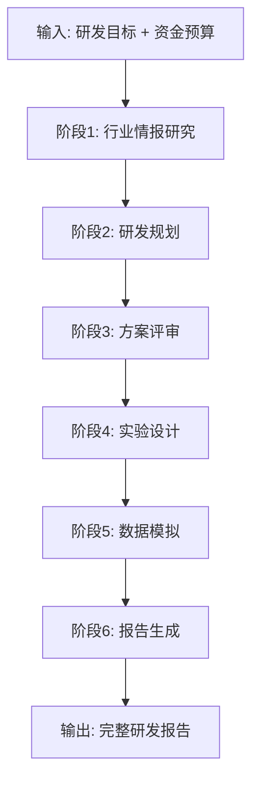

# 🍎 食品与生工领域多智能体研发模拟系统

基于 CrewAI 和 Ollama 构建的智能自动化研发系统，专为食品科学与生物工程领域设计的多智能体协作平台。

## 🚀 系统特性

- **专业领域定制**：针对食品科学和生物工程领域深度优化
- **多智能体协作**：6个专业Agent按序执行，确保研发质量
- **Ollama本地部署**：使用 qwen3.5:cloud 模型，保护数据安全
- **智能数据模拟**：基于物理化学规律生成真实的实验数据
- **完整工作流**：从情报研究到最终报告的全流程自动化

## 🤖 Agent 架构

系统包含 6 个专业 Agent，严格按照线性工作流程执行：

| 阶段 | Agent | 职责 | 专业能力 |
|------|-------|------|----------|
| 1 | **行业情报研究员** | 行业信息搜集与分析 | 技术难点分析、专利检索、市场调研 |
| 2 | **首席研发规划师** | 研发计划制定 | 项目规划、资源配置、时间管理 |
| 3 | **方案评审专家** | 方案可行性评审 | 技术评估、风险分析、优化建议 |
| 4 | **实验设计与操作员** | 实验方案设计 | 工艺参数设计、SOP制定、质量控制 |
| 5 | **实验数据模拟器** | 虚拟实验执行 | 数据生成、统计分析、异常模拟 |
| 6 | **报告总结分析师** | 成果整合与报告 | 数据分析、结论推导、未来规划 |

## 📁 项目结构

```
AutoRandD/
├── src/
│   ├── agents/                    # Agent 实现
│   │   ├── __init__.py
│   │   ├── base_agent.py          # Agent 基类
│   │   ├── industry_researcher.py # 行业情报研究员
│   │   ├── rd_planner.py          # 首席研发规划师
│   │   ├── plan_reviewer.py       # 方案评审专家
│   │   ├── experiment_designer.py # 实验设计师
│   │   ├── data_simulator.py      # 数据模拟器
│   │   └── report_analyst.py      # 报告分析师
│   ├── tools/                     # 工具集
│   │   ├── __init__.py
│   │   ├── search_tools.py        # 搜索工具
│   │   └── science_tools.py       # 科学专业工具
│   ├── workflows/                 # 工作流
│   │   ├── __init__.py
│   │   └── food_rd_workflow.py   # 主工作流
│   ├── config/                    # 配置
│   │   ├── __init__.py
│   │   └── model_config.py       # 模型配置
│   └── __init__.py
├── data/                          # 数据输出目录
├── docs/                          # 项目文档
├── logs/                          # 日志文件
├── tests/                         # 测试文件
├── main.py                        # 主程序入口
├── requirements.txt               # 依赖管理
├── .env.example                   # 环境变量示例
└── README.md
```

## 🛠️ 安装与配置

### 环境要求

- Python 3.8+
- Ollama 服务 (http://localhost:11434)
- 至少 8GB 内存
- uv (推荐) 或 pip

### 安装步骤

1. 克隆仓库
```bash
git clone <repository-url>
cd AutoRandD
```

2. 使用 uv 创建项目环境
```bash
uv init  # uv 会自动创建和管理虚拟环境
```

3. 安装依赖
```bash
# 使用 uv 创建项目并安装依赖
uv init
uv add crewai>=0.28.0 crewai-tools>=0.3.0
uv add langchain-community>=0.0.38 langchain>=0.1.0
uv add duckduckgo-search>=4.0.0 tavily-search>=0.3.0 serper-dev>=0.3.0
uv add requests>=2.31.0 beautifulsoup4>=4.12.0
uv add pandas>=2.0.0 numpy>=1.24.0 pydantic>=2.4.0
uv add python-dotenv>=1.0.0 rich>=13.0.0 pyyaml>=6.0 aiofiles>=23.0.0
uv add scipy>=1.11.0 matplotlib>=3.7.0 tqdm>=4.66.0
```

或者使用单个命令安装所有依赖：
```bash
uv pip install -r requirements.txt
```

4. 安装 Ollama
```bash
# 安装 Ollama
# macOS
curl -fsSL https://ollama.com/install.sh | sh

# Linux
curl -fsSL https://ollama.com/install.sh | sh

# Windows
# 下载并运行 Ollama installer
```

5. 启动 Ollama 服务
```bash
ollama serve
```

6. 下载模型
```bash
ollama pull qwen3.5:cloud
```

7. 配置环境变量
```bash
cp .env.example .env
# 编辑 .env 文件，配置必要参数
```

## 💡 使用方法

### 安装依赖（推荐使用 uv）

```bash
# 安装 uv
curl -LsSf https://astral.sh/uv/install.sh | sh

# 使用 uv 安装依赖
uv sync              # 安装所有依赖（使用 pyproject.toml）
uv pip install -r requirements.txt  # 或使用 requirements.txt

# 升级单个包
uv add crewai@latest
```

### 交互式使用

```bash
python main.py
```

按照菜单提示操作：
1. 选择"开始新的研发项目"
2. 输入研发目标（如："研发一款具有清新口气功能的茶多酚爆珠"）
3. 输入资金预算（如："50万元人民币"）
4. 等待系统自动执行

### 编程方式使用

```python
import asyncio
from src.workflows.food_rd_workflow import run_food_rd_project

async def main():
    # 运行完整工作流
    result = await run_food_rd_project(
        research_goal="研发一款具有清新口气功能的茶多酚爆珠",
        funding="50万元人民币"
    )
    print(result)

asyncio.run(main())
```

## 🔄 工作流程



## 📝 输入参数

### 必需参数
1. **research_goal** (字符串)
   - 示例: "研发一款具有清新口气功能的茶多酚爆珠"
   - 示例: "冷加工蛋白棒的成型工艺优化"

2. **funding** (字符串)
   - 示例: "50万元人民币"
   - 示例: "100万人民币"

### 输出文档

系统将自动生成以下文档：

1. **行业情报报告** (`data/intelligence_report_*.json`)
   - 技术现状分析
   - 市场调研结果
   - 竞争格局分析
   - 参考文献列表

2. **研发计划书** (`data/rd_plan_*.json`)
   - 项目阶段划分
   - 资源配置方案
   - 时间表和里程碑
   - 风险管理计划

3. **最终版计划** (`data/final_rd_plan_*.json`)
   - 评审后的优化方案
   - 改进建议
   - 风险预案
   - 质量控制措施

4. **实验SOP** (`data/sop_document_*.json`)
   - 详细工艺参数
   - 标准操作流程
   - 质量控制标准
   - 安全操作规范

5. **模拟数据报告** (`data/simulation_report_*.json`)
   - 实验数据矩阵
   - 统计分析结果
   - 异常情况模拟
   - 数据质量评估

6. **最终项目报告** (`data/final_report_*.md`)
   - 项目执行总结
   - 科学结论
   - 未来展望
   - 改进建议

## 🎯 应用场景

- **食品企业研发部门**：加速新产品研发周期
- **生物技术公司**：优化工艺参数，提高产品质量
- **科研院所**：辅助科研立项和方案设计
- **高校实验室**：教学演示和科研训练
- **投资机构**：技术项目可行性评估

## 🔧 高级配置

## 🛠️ uv 常用命令

```bash
# 创建新项目并安装依赖
uv init
uv add package_name

# 安装现有依赖
uv sync              # 基于 pyproject.toml
uv pip install -r requirements.txt

# 运行脚本（使用虚拟环境中的 Python）
uv run python main.py

# 开发模式（热重载）
uv run --watch python main.py

# 清理依赖
uv sync --frozen
```

### 自定义模型参数

在 `.env` 文件中调整：
```env
OLLAMA_MODEL=qwen3.5:cloud
OLLAMA_TEMPERATURE=0.7
OLLAMA_MAX_TOKENS=4000
```

### 使用高级搜索API

申请以下API密钥以获得更好的搜索效果：
- Tavily API：高质量网络搜索
- Serper API：Google搜索
- Google Patents API：专利搜索

### 数据存储配置

```env
DATA_DIR=./data
OUTPUT_DIR=./outputs
LOG_LEVEL=INFO
```

## 🤝 贡献指南

欢迎提交 Issue 和 Pull Request！

### 开发环境设置

1. Fork 本仓库
2. 创建特性分支：`git checkout -b feature/your-feature`
3. 提交更改：`git commit -m 'Add your feature'`
4. 推送分支：`git push origin feature/your-feature`
5. 创建 Pull Request

### 代码规范

- 遵循 PEP 8 代码风格
- 添加详细的中文注释
- 编写单元测试
- 更新相关文档

## 📄 许可证

MIT License

## 👀 更新日志

### v1.0.0 (2024-03-12)
- 初始版本发布
- 实现完整的6阶段工作流
- 集成 CrewAI 框架
- 支持 Ollama 模型

## 🙏 致谢

- [CrewAI](https://github.com/joaomdmoura/crewAI) - 多智能体框架
- [Ollama](https://ollama.com/) - 本地模型部署
- [LangChain](https://github.com/langchain-ai/langchain) - AI 应用开发框架
- [Rich](https://github.com/Textualize/rich) - 终端美化库

---

## 📞 联系方式

如有问题或建议，请通过以下方式联系：

- 提交 Issue
- 发送邮件至项目维护者
